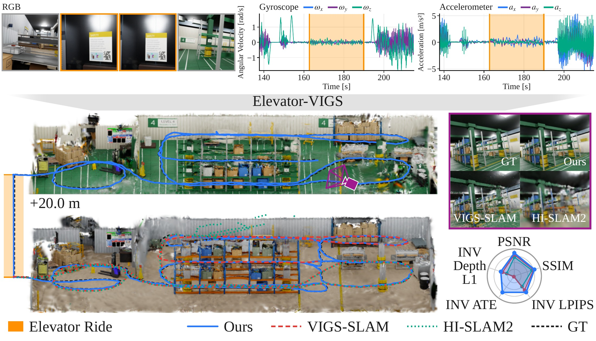

<!-- PROJECT LOGO -->

<p align="center">

  <h1 align="center">Elevator-VIGS: Separating Elevator Motion from Robot Motion<br/>in Visual-Inertial Gaussian Splatting SLAM</h1>
  <p align="center">
    <a href="https://ruizhou-cn.github.io/"><strong>Rui Zhou</strong></a><sup>*</sup>
    ·
    <a href="https://zzh2000.github.io"><strong>Zihan Zhu</strong></a><sup>*</sup>
    ·
    <a href="https://willyzw.github.io"><strong>Wei Zhang</strong></a>
    ·
    <a href="https://www.linkedin.com/in/zizhou-luo-b34320268/"><strong>Zizhou Luo</strong></a>
    ·
    <a href="https://www.ifp.uni-stuttgart.de/institut/team/Haala-00001/"><strong>Norbert Haala</strong></a>
    ·
    <a href="https://people.inf.ethz.ch/pomarc/"><strong>Marc Pollefeys</strong></a>
  </p>
  <p align="center"><sup>*</sup> Equal contribution</p>
  <h3 align="center"><a href="https://arxiv.org/abs/2609.23491">Paper</a> | <a href="https://youtu.be/3-TDg8bdD68">Video</a> | <a href="https://ruizhou-cn.github.io/elevator-vigs">Project Page</a> | <a href="https://huggingface.co/datasets/Rui5125/Elevator-VIGS">Dataset</a></h3>
  <div align="center"></div>
</p>
<p align="center">
    
</p>

<p align="center">
Given a sequence of RGB frames and IMU readings, Elevator-VIGS keeps tracking and mapping through elevator rides, recovering metric floor-to-floor travel from a camera and an IMU alone.
</p>
<br>

<!-- TABLE OF CONTENTS -->
<details open="open" style='padding: 10px; border-radius:5px 30px 30px 5px; border-style: solid; border-width: 1px;'>
  <summary>Table of Contents</summary>
  <ol>
    <li>
      <a href="#getting-started">Getting Started</a>
    </li>
    <li>
      <a href="#run-demo">Run Demo</a>
    </li>
    <li>
      <a href="#dataset-preparation">Dataset Preparation</a>
    </li>
    <li>
      <a href="#batched-run--evaluation">Batched Run & Evaluation</a>
    </li>
    <li>
      <a href="#citation">Citation</a>
    </li>
    <li>
      <a href="#acknowledgements">Acknowledgements</a>
    </li>
    <li>
      <a href="#license">License</a>
    </li>
  </ol>
</details>


## Getting Started

1. Clone the repo with submodules
```bash
git clone --recursive https://github.com/RuiZhou-cn/Elevator-VIGS.git
```

2. Install the system prerequisites. The conda environment does not ship `nvcc`, so the [CUDA 12.8 toolkit](https://developer.nvidia.com/cuda-12-8-0-download-archive) must be installed system-wide with `CUDA_HOME` pointing at it.
```bash
sudo apt install build-essential libeigen3-dev
export CUDA_HOME=/usr/local/cuda-12.8 PATH=/usr/local/cuda-12.8/bin:$PATH
```

3. Create and activate the Conda environment (PyTorch 2.8 + CUDA 12.8, tested on RTX 5090).
```bash
conda env create -f environment_5090.yaml
conda activate elevator-vigs
```

4. Build the native modules (about 10 minutes): the CUDA kernels, the IMU C++ module and `sophuspy` / `torch-scatter` from source.
```bash
bash scripts/install.sh
```

5. Download the Omnidata weights for the depth and normal priors
```bash
wget https://zenodo.org/records/10447888/files/omnidata_dpt_normal_v2.ckpt -P pretrained_models
wget https://zenodo.org/records/10447888/files/omnidata_dpt_depth_v2.ckpt -P pretrained_models
```

> **Note:** `pretrained_models/droid.pth` is bundled from [DROID-SLAM](https://github.com/princeton-vl/DROID-SLAM) (BSD-3-Clause). The SigLIP 2 model and the Omnidata backbone are fetched from the Hugging Face Hub on the first run.

6. (Optional) TensorRT acceleration. The numbers reported in the paper were produced with these engines.

<details>
<summary><b>Build Instructions</b></summary>

With the environment activated and the step-5 weights in place, run from the repository root:
```bash
bash scripts/build_trt_engines.sh
```

The engines are written to `pretrained_models/` and picked up automatically; without them the code falls back to PyTorch. Engines are GPU-specific — rebuild after a GPU, driver or TensorRT change. On a smaller GPU, lower `WORKSPACE_MB` at the top of the script.

</details>

<details>
<summary><b>Trouble Shooting</b></summary>

1. **`conda env create` stops with `CondaToSNonInteractiveError`.** Accept the channel terms once and retry: `conda tos accept --override-channels --channel https://repo.anaconda.com/pkgs/main --channel https://repo.anaconda.com/pkgs/r`.

2. **`scripts/install.sh` stops in its preflight.** The message names the missing piece and the step that provides it.

3. **`No module named 'imu_integrator_cpp'`.** Delete `vigs/imu_cpp/build/` and rerun step 4 with the environment activated.

4. **`Not compiled with CUDA support` from `torch_scatter`.** It was built with `CUDA_HOME` unset. Export it (step 2) and rerun step 4.

5. **`Sophus ensure failed ... R is not orthogonal` during IMU initialization.** `-DSOPHUS_DISABLE_ENSURES` in `vigs/imu_cpp/CMakeLists.txt` is required, not optional.

6. **`no kernel image is available for execution on the device`.** `setup.py` compiles for sm_60 through sm_120; add your `-gencode` flag there if your GPU is outside this range. The two `thirdparty/` kernels follow `TORCH_CUDA_ARCH_LIST`, e.g. `TORCH_CUDA_ARCH_LIST="8.9;12.0"`.

</details>

## Run Demo

The demo runs on `Campus3` from our dataset. Results go to `outputs/demo/`: camera poses and, with `--gsmapping`, the Gaussian map and renderings.

Download the demo data:

```bash
bash scripts/prep_demo.sh
```

Then run:

```bash
python demo.py \
--imagedir data/Elevator-VIGS/real/Campus3/images \
--calib data/Elevator-VIGS/real/Campus3/calib.txt \
--config config/elevator_real.yaml \
--imufile data/Elevator-VIGS/real/Campus3/imu.txt \
--output outputs/demo \
[--gsmapping]    # Optional: enable Gaussian mapping
[--offline]      # Optional: post-process after tracking — final BA, and with --gsmapping the map refinement
[--gsvis]        # Optional: enable Gaussian map display (OpenGL window); implies --gsmapping
[--droidvis]     # Optional: enable point cloud display (OpenGL window)
[--rerunvis]     # Optional: live visualization in the Rerun web viewer
[--rerun_record] # Optional: save a .rrd file for later replay with Rerun
```

> **Note:** `--rerunvis` and `--rerun_record` are mutually exclusive; live streaming takes priority.

**Live visualization** (`--rerunvis`): open the printed URL in your browser. On a remote server, forward both ports first:
```bash
ssh -L 9876:127.0.0.1:9876 -L 9877:127.0.0.1:9877 <your_server>
```

**Replay a saved Rerun recording** (`--rerun_record`):
```bash
rerun outputs/demo/rerun_stream.rrd
```

---


## Dataset Preparation
> **Note:** By downloading any of the following datasets, you agree to the terms and conditions set by the respective dataset providers. Please review each dataset's license before use.
### EuRoC Dataset
Download the processed [EuRoC Dataset](https://www.research-collection.ethz.ch/entities/researchdata/bcaf173e-5dac-484b-bc37-faf97a594f1f) using the script below
```bash
bash scripts/prep_euroc.sh
```

### RPNG AR Table Dataset
Download the processed [RPNG AR Table Dataset](https://github.com/rpng/ar_table_dataset) using the script below
```bash
bash scripts/prep_rpng.sh
```

### UTMM Dataset
Download the processed [UTMM](https://huggingface.co/datasets/neel1302/UT-MM/tree/main) dataset using the script below
```bash
bash scripts/prep_utmm.sh
```

### FAST-LIVO2 Dataset
Download the processed FAST-LIVO2 dataset using the script below
```bash
bash scripts/prep_livo2.sh
```

### Elevator-VIGS Dataset
Download our [Elevator-VIGS dataset](https://huggingface.co/datasets/Rui5125/Elevator-VIGS) (16 real recordings and 16 simulated sequences, 42 GB) using the script below
```bash
bash scripts/prep_elevator.sh
```


## Batched Run & Evaluation

> Each script runs all sequences in batch. A sequence whose run already exists under `outputs/` is scored, not re-run.

### EuRoC Dataset

> **Note:** Place all sequences directly under a single base folder (e.g. `data/euroc/MH_01_easy/`, `data/euroc/V1_01_easy/`). Do **not** nest them in sub-categories such as `Machine Hall/` — the evaluation script expects a flat layout.

> **Note:** The EuRoC ground-truth trajectories used for evaluation are provided in `euroc_groundtruth/`. These are taken from [DROID-SLAM](https://github.com/princeton-vl/DROID-SLAM) and are expressed in the **image (camera) coordinate frame** (rather than the original EuRoC body/IMU frame), so they align directly with the estimated camera trajectories.

```bash
python eval_public_mono.py --dataset euroc
```

### RPNG AR Table Dataset
```bash
python eval_public_mono.py --dataset rpng
```

### UTMM Dataset
```bash
python eval_public_mono.py --dataset utmm
```

### FAST-LIVO2 Dataset
```bash
python eval_public_mono.py --dataset fastlivo
```

### Elevator-VIGS Dataset
Runs both benchmarks: the real recordings are scored by floor-height error against the laser-measured rise, the simulated sequences by Sim(3)-aligned ATE. Add `--gsmapping` to also train the Gaussian map.
```bash
python eval_elevator_mono.py
```

## Citation

If you find our code or paper useful, please cite:
```bibtex
@misc{zhou2026elevatorvigsseparatingelevatormotion,
      title={Elevator-VIGS: Separating Elevator Motion from Robot Motion in Visual-Inertial Gaussian Splatting SLAM}, 
      author={Rui Zhou and Zihan Zhu and Wei Zhang and Zizhou Luo and Norbert Haala and Marc Pollefeys},
      year={2026},
      eprint={2609.23491},
      archivePrefix={arXiv},
      primaryClass={cs.RO},
      url={https://arxiv.org/abs/2609.23491}, 
}
```

## Acknowledgements

Elevator-VIGS is built on [VIGS-SLAM](https://github.com/cvg/VIGS-SLAM), which in turn adapts code from [DROID-SLAM](https://github.com/princeton-vl/DROID-SLAM), [HI-SLAM2](https://github.com/Willyzw/HI-SLAM2), [Omnidata](https://github.com/EPFL-VILAB/omnidata) and [3D Gaussian Splatting](https://github.com/graphdeco-inria/gaussian-splatting). Thanks for making codes public available.

## License
This project is released under the [Apache 2.0 license](LICENSE). Some of the adapted components are covered by their own, and in some cases more restrictive, licenses, so different parts of this repository may be under different licenses. Please review and comply with the license of each original project before using the corresponding parts of this repository.
